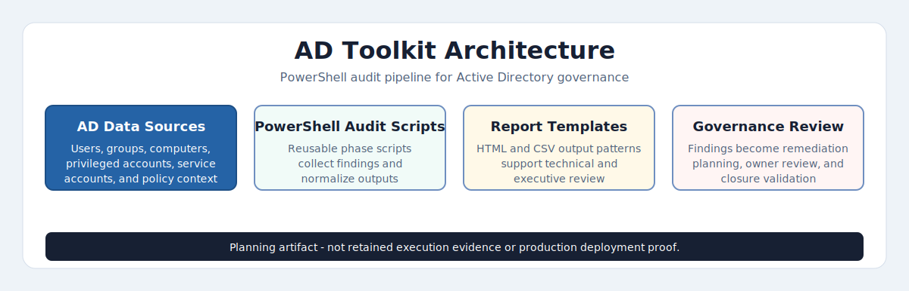
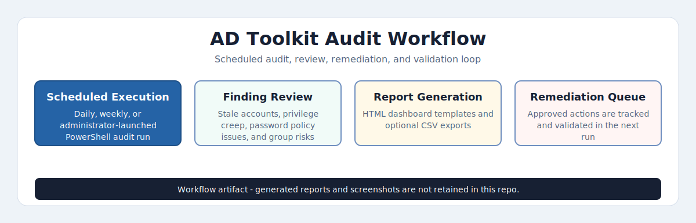
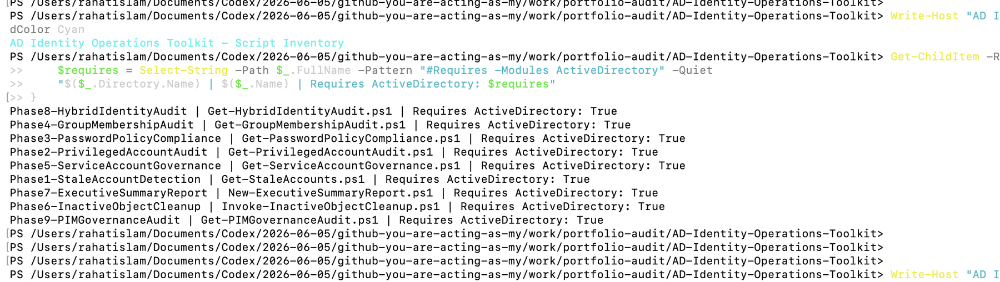
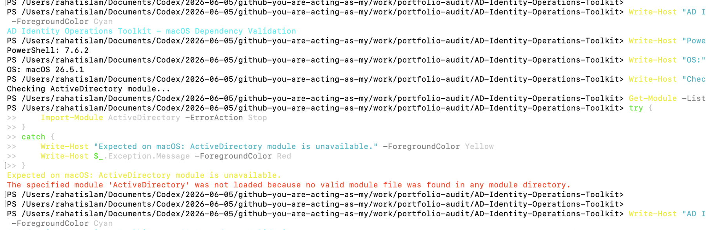
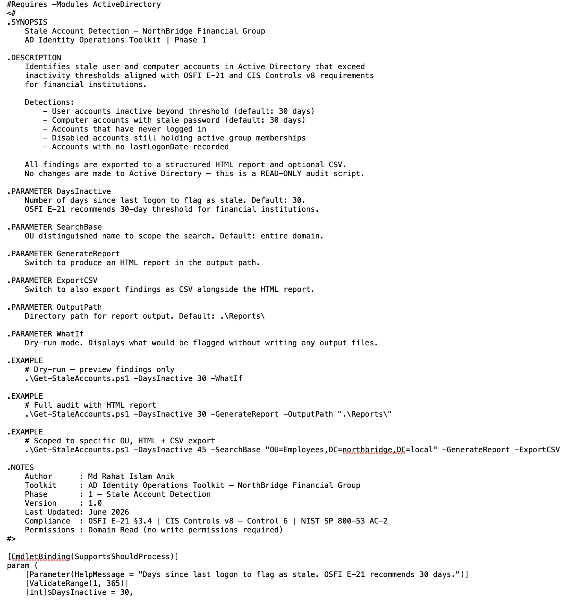

# 🏦 AD Identity Operations Toolkit
### NorthBridge Financial Group — Enterprise Active Directory Governance


---

## 📋 Overview

The **AD Identity Operations Toolkit** is a production-style PowerShell framework designed to audit common Active Directory identity governance risks in a simulated financial-services environment. It maps common AD administration tasks to **OSFI E-21**, **CIS Controls v8**, and **NIST SP 800-53** themes while keeping the repo focused on reusable script logic, report templates, and operational runbook design.

Developed for a simulated **NorthBridge Financial Group** environment that models enterprise AD governance concerns such as privilege separation, fine-grained password policies, stale objects, service account sprawl, hybrid identity readiness, and standing privileged access.

> ⚠️ Most scripts are read-only audit scripts. Phase 6 includes optional disable, move, and delete workflow switches for lab validation; those actions should only be used in a controlled AD lab or approved change window.

---

## Evidence Status

| Artifact | Current Status |
|---|---|
| PowerShell audit scripts | Included |
| HTML report templates | Included inside scripts |
| Generated HTML reports | Not retained |
| macOS validation screenshots | Included |
| Live AD lab execution evidence | Phase 10 evidence screenshots included — 12 artifacts |
| Sample output folder | Phase 10 CSV outputs included — see SampleOutputs/ |
| Safety model | Documented in README, runbook, and Phase 6 script |

This repository should be reviewed as a **code-centered Active Directory governance toolkit**. It includes screenshot evidence for script inventory and macOS dependency validation, but does not currently include generated reports or live Windows Active Directory execution screenshots from the original lab run.

---

## Version 1 Status

This repository is currently complete as a Version 1 code-centered Active Directory governance toolkit. It includes the script framework, phase documentation, architecture visualization, audit workflow visualization, and operational runbook.

Current evidence includes the README-visible architecture and audit workflow visuals, linked GitHub Pages HTML versions, script inventory evidence, and macOS dependency validation evidence. Generated HTML reports, CSV outputs, and live AD execution screenshots are planned future validation artifacts and are not currently claimed as retained execution evidence.

The toolkit requires a Windows Active Directory administration environment with the ActiveDirectory PowerShell module available through RSAT or Windows Server. macOS PowerShell dependency validation confirmed that the scripts correctly enforce this dependency through `#Requires -Modules ActiveDirectory`; the scripts are not claimed to have executed successfully on macOS.

The next major improvement is to run the scripts in a Windows AD lab and add sanitized generated reports, CSV outputs, and Windows Server, RSAT, or domain controller screenshots.

---

## 🗂️ Repository Structure

```
AD-Identity-Operations-Toolkit/
│
├── Phase1-StaleAccountDetection/
│   └── Get-StaleAccounts.ps1
│
├── Phase2-PrivilegedAccountAudit/
│   └── Get-PrivilegedAccountAudit.ps1
│
├── Phase3-PasswordPolicyCompliance/
│   └── Get-PasswordPolicyCompliance.ps1
│
├── Phase4-GroupMembershipAudit/
│   └── Get-GroupMembershipAudit.ps1
│
├── Phase5-ServiceAccountGovernance/
│   └── Get-ServiceAccountGovernance.ps1
│
├── Phase6-InactiveObjectCleanup/
│   └── Invoke-InactiveObjectCleanup.ps1
│
├── Phase7-ExecutiveSummaryReport/
│   └── New-ExecutiveSummaryReport.ps1
│
├── Phase8-HybridIdentityAudit/
│   └── Get-HybridIdentityAudit.ps1
│
├── Phase9-PIMGovernanceAudit/
│   └── Get-PIMGovernanceAudit.ps1
│
├── Phase10-PasswordlessModernization/
│   ├── Scripts/                    # Passwordless readiness + TAP provisioning scripts
│   ├── Docs/                       # Architecture, rollout plan, pilot plan, support model
│   ├── Diagrams/                   # Mermaid architecture + rollout workflow diagrams
│   ├── SampleOutputs/              # CSV outputs — readiness, auth methods, TAP log
│   ├── Evidence/                   # 12 evidence screenshots
│   └── Executive-Case-Study/       # CISO-ready executive case study
│
│   🔗 Companion Project: Full enterprise passwordless architecture, deployment
│      governance, and Conditional Access design →
│      NorthBridge-Passwordless-Modernization
│      https://github.com/rahatislamanik-spec/NorthBridge-Passwordless-Modernization
│
├── Reports/                        # Auto-generated HTML reports (gitignored)
├── SampleOutputs/                  # Placeholder for future sanitized sample reports
├── evidence/
│   ├── macos-active-directory-module-validation.png
│   ├── phase1-script-header-active-directory-requirement.png
│   └── script-inventory-active-directory-requirement.png
│
├── docs/
│   ├── ad-toolkit-architecture.html
│   ├── ad-toolkit-audit-workflow.html
│   ├── images/
│   │   ├── ad-toolkit-architecture.svg
│   │   └── ad-toolkit-audit-workflow.svg
│   └── NorthBridge-AD-Governance-Runbook.md
└── README.md
```

---

## Architecture & Audit Workflow



Visualizes the toolkit pipeline from AD data sources to PowerShell audits, report templates, governance review, and remediation planning.

[View interactive HTML version](https://rahatislamanik-spec.github.io/AD-Identity-Operations-Toolkit/docs/ad-toolkit-architecture.html)



Visual workflow showing scheduled PowerShell audit execution, AD object review, report generation, governance review, approved remediation, and next-run validation.

[View interactive HTML version](https://rahatislamanik-spec.github.io/AD-Identity-Operations-Toolkit/docs/ad-toolkit-audit-workflow.html)

These artifacts explain the intended architecture and operating model for the toolkit. They are not retained execution evidence, generated reports, or proof of production deployment.

---

## Evidence Snapshot

These screenshots are macOS validation artifacts only. They confirm script inventory and dependency enforcement. They are not live Active Directory execution evidence.

### Script Inventory



Shows all nine PowerShell phase scripts and confirms each script declares the `ActiveDirectory` module requirement.

### macOS Dependency Validation



Shows PowerShell on macOS cannot load the `ActiveDirectory` module, confirming the toolkit requires Windows RSAT or Windows Server for live AD execution.

### Phase 1 Script Header



Shows the Phase 1 read-only audit purpose, report output options, and `ActiveDirectory` module dependency.

---

## 🔐 Phase Breakdown

### Phase 1 — Stale Account Detection
Identifies user and computer accounts that have exceeded inactivity thresholds aligned with financial institution standards (30-day threshold vs. enterprise 90-day default). Flags accounts by OU, department, and last logon delta. Outputs interactive HTML report with sortable risk table.

**Key detections:** Accounts inactive >30 days · Never-logged-in accounts · Disabled accounts still holding group memberships · Computer accounts with stale `pwdLastSet`

---

### Phase 2 — Privileged Account Audit
Enumerates all Tier 0 and Tier 1 privileged principals across Domain Admins, Schema Admins, Enterprise Admins, Backup Operators, and Account Operators. Performs recursive nested group explosion to surface shadow privilege paths.

**Key detections:** Nested group privilege escalation · Admin accounts with no MFA indicator · Privileged accounts with non-expiring passwords · Service accounts in Tier 0 groups

---

### Phase 3 — Password Policy Compliance
Audits both default domain password policy and Fine-Grained Password Policies (FGPPs) across all PSOs. Maps policy coverage gaps and identifies accounts falling outside compliant policy scope.

**Key detections:** Accounts with `PasswordNeverExpires` · Accounts with `PasswordNotRequired` · PSO coverage gaps · Policy strength vs. OSFI E-21 minimums

---

### Phase 4 — Group Membership Audit
Analyses AD security group health across the environment. Detects circular nesting, orphaned groups, over-privileged distribution lists, and groups exceeding membership thresholds.

**Key detections:** Circular group nesting · Empty security groups · Groups >500 members without governance owner · Distribution lists with nested security groups

---

### Phase 5 — Service Account Governance
Enumerates all service accounts by convention and SPN registration. Flags Kerberoastable accounts, SPNs registered on user objects, and service accounts operating outside dedicated OUs.

**Key detections:** Kerberoastable accounts (SPN on user objects) · Service accounts in privileged groups · Accounts without `msDS-ManagedPassword` (non-gMSA) · SPN conflicts

---

### Phase 6 — Inactive Object Cleanup Workflow
Implements a staged disable → move → delete remediation model for lab validation. The default behavior is discovery and preview; write actions require explicit execution switches and should be used only after review, approval, and backup validation.

**Pipeline:** Discovery → Risk Classification → Dry-Run Preview → Staged Disable → OU Quarantine → 30-Day Hold → Deletion with audit log

---

### Phase 7 — Executive Summary Report
Aggregates findings from all phases into a single executive-ready HTML report with risk scoring, trend indicators, and OSFI E-21 control mapping. Designed for CISO and audit committee consumption.

**Output:** Risk-scored HTML dashboard template · Control gap heatmap · Remediation priority matrix · Print/PDF-friendly layout

---

### Phase 8 — Hybrid Identity & Entra ID Sync Audit
Audits the hybrid identity boundary where on-premises AD is synchronized to Microsoft Entra ID via Azure AD Connect. Detects privileged accounts synced to the cloud, AADC service account misconfigurations, UPN conflicts, and stale synced accounts active in both environments.

**Key detections:** Privileged accounts synced to Entra ID · Azure AD Connect service account audit · UPN suffix mismatches · adminCount=1 on synced accounts · Stale synced accounts · ProxyAddress conflicts

---

### Phase 9 — Privileged Identity Management (PIM) Audit
Audits permanent privileged role assignments across the domain and identifies PIM governance gaps. Detects accounts that should be converted to just-in-time eligible roles, SDProp adminCount artifacts, non-dedicated admin accounts with permanent privilege, and stale standing privileged access.

**Key detections:** Permanent Domain Admin assignments · SDProp adminCount=1 artifacts · Non-dedicated accounts with standing privilege · Stale permanent privileged accounts · Cloud-synced privileged principals · Service accounts with permanent admin rights

---

## ⚙️ Requirements

| Component | Minimum Version |
|---|---|
| PowerShell | 5.1+ (7.x recommended) |
| RSAT: AD DS Tools | Windows Server 2019/2022 |
| ActiveDirectory Module | Included with RSAT |
| Permissions | Domain read for audit phases; delegated/elevated rights only for Phase 6 write actions |
| OS | Windows Server 2019 / Windows 10-11 with RSAT |

---

## 🚀 Quick Start

```powershell
# Clone the repository
git clone https://github.com/rahatislamanik-spec/AD-Identity-Operations-Toolkit.git
cd AD-Identity-Operations-Toolkit

# Import the AD module (if not auto-loaded)
Import-Module ActiveDirectory

# Run Phase 1 in dry-run mode
.\Phase1-StaleAccountDetection\Get-StaleAccounts.ps1 -DaysInactive 30 -WhatIf

# Run Phase 1 and generate HTML report
.\Phase1-StaleAccountDetection\Get-StaleAccounts.ps1 -DaysInactive 30 -GenerateReport -OutputPath ".\Reports\"
```

---

## Limitations

- This repo currently contains script logic and documentation, but not retained screenshots or generated report artifacts.
- Compliance mappings are educational control references, not a formal audit opinion or certification.
- Hybrid Identity and PIM phases include on-premises AD indicators; full Entra ID cloud-side validation requires Microsoft Graph modules and appropriate permissions.
- Phase 6 can disable, move, or delete AD objects when execution switches are supplied. Test in a lab first and use formal change control in any real environment.
- Some detections rely on naming conventions, AD attributes, or available module data and should be tuned for each organization.

---

## Future Validation Plan

1. Rebuild a Windows Server 2022 Active Directory lab.
2. Create safe sample users, stale accounts, privileged groups, service accounts, and hybrid identity attributes.
3. Run Phases 1-9 and retain sanitized HTML/CSV reports.
4. Capture screenshots of script execution, report output, and relevant AD views.
5. Add a phase-by-phase evidence map linking scripts, reports, and screenshots.
6. Re-review Phase 6 against a written change-control checklist before demonstrating write actions.

---

## 🏛️ Compliance Mapping

| Control Area | Framework Reference | Phase Coverage |
|---|---|---|
| Privileged Access Management | OSFI E-21 §3.2 · CIS Control 5 | Phase 2, 5 |
| Account Lifecycle Management | OSFI E-21 §3.4 · CIS Control 6 | Phase 1, 6 |
| Password & Authentication Policy | OSFI E-21 §3.3 · NIST 800-53 IA-5 | Phase 3 |
| Access Reviews & Recertification | CIS Control 6.3 · SOC 2 CC6.3 | Phase 2, 4 |
| Service Account Security | CIS Control 5.6 · NIST 800-53 AC-6 | Phase 5 |
| Audit Logging | OSFI E-21 §4.1 · CIS Control 8 | Phase 6, 7 |
| Hybrid Identity Governance | OSFI E-21 §3.2/3.4 · NIST SP 800-53 IA-2 | Phase 8 |
| Just-In-Time Privileged Access | OSFI E-21 §3.2 · CIS Control 5.4 · NIST AC-6(5) | Phase 9 |
| Passwordless Modernization | OSFI E-21 §3.3 · NIST SP 800-63B · CIS Control 5.2 | Phase 10 · [NorthBridge Companion →](https://github.com/rahatislamanik-spec/NorthBridge-Passwordless-Modernization) |

---

## 🔗 Companion Project — NorthBridge Passwordless Modernization

Phase 10 of this toolkit covers the **PowerShell assessment layer** for passwordless readiness — scripts, CSV outputs, TAP provisioning, and authentication method auditing.

The full enterprise passwordless deployment project lives in a dedicated companion repo:

| | |
|---|---|
| **Repo** | [NorthBridge-Passwordless-Modernization](https://github.com/rahatislamanik-spec/NorthBridge-Passwordless-Modernization) |
| **What it covers** | Enterprise architecture, Conditional Access authentication strength policies, 40,000-user rollout plan, pilot governance, help desk procedures, break-glass model |
| **Relationship** | Phase 10 scripts feed into the NorthBridge deployment. Same fictional NorthBridge Financial Group scenario. Complementary, not duplicate. |

---

## 🔗 Related Portfolio Projects

| Project | Description |
|---|---|
| [Enterprise IT Security Operations Toolkit](https://github.com/rahatislamanik-spec/Enterprise-IT-Security-Operations-Toolkit) | M365 security automation — Exchange, Entra ID, Defender XDR |
| [Meridian Institute M365 Lab](https://github.com/rahatislamanik-spec/Meridian-Institute-M365-Lab) | End-to-end M365 tenant governance simulation |
| [Enterprise IT Network Diagnostics Toolkit](https://github.com/rahatislamanik-spec/Enterprise-IT-Network-Diagnostics-Toolkit) | Cross-platform PowerShell network diagnostics |

---

## 👤 Author

**Md Rahat Islam Anik**
IT Systems Administrator · M365 & Identity Specialist · Security Operations

[](https://rahatislamanik-spec.github.io/IT-Portfolio-Rahat-Islam-Anik)
[](https://linkedin.com/in/rahatislamanik)
[](https://github.com/rahatislamanik-spec)

---

*Built as a production-style Active Directory identity governance toolkit for portfolio demonstration and lab validation. Most phases are read-only audits; Phase 6 write actions require explicit execution switches and should be tested only in controlled environments.*
